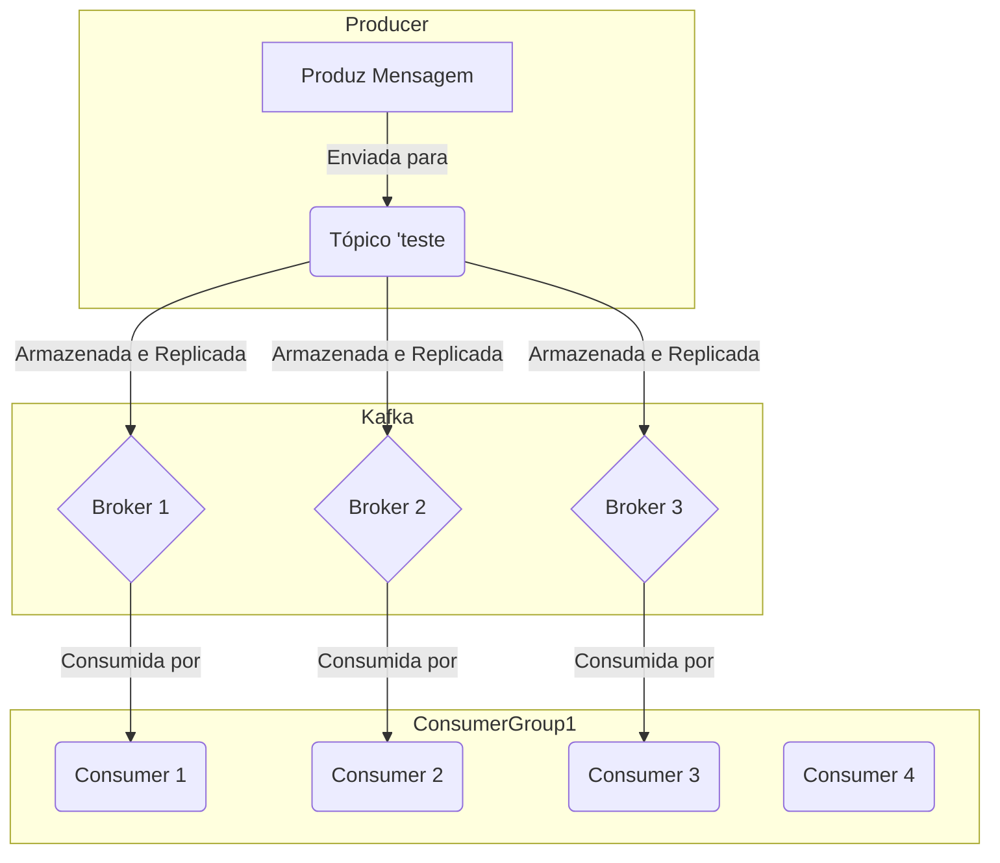

# POC (Proof of Concept) - Kafka com Go

## O que é o Kafka? :writing_hand:

O Apache Kafka é uma plataforma de streaming de dados de código aberto projetada para lidar com o processamento e a transmissão de grandes volumes de dados em tempo real de maneira escalável e durável. Funcionando como um sistema de mensagens distribuído, o Kafka é especialmente eficaz em ambientes onde é crucial a transmissão eficiente de eventos e atualizações entre sistemas. Ele utiliza uma arquitetura distribuída que permite a persistência de dados e a capacidade de processar eventos em tempo real, sendo amplamente adotado em cenários como pipelines de dados, integração de microsserviços e registros de alterações em tempo real.

O Kafka é construído em torno de um modelo de tópicos, onde os produtores publicam mensagens em tópicos específicos, e os consumidores podem se inscrever para receber essas mensagens. Essa abordagem distribuída e de alta disponibilidade torna o Kafka uma escolha popular para cenários em que a confiabilidade, a escalabilidade e o processamento em tempo real são fundamentais, como em aplicações de análise de dados, monitoramento de infraestrutura e implementações de arquiteturas de microserviços.
 
 ## Visualização da Arquitetura :framed_picture:

Este repositório contém uma prova de conceito (POC) que ilustra a integração do Apache Kafka com a linguagem de programação Go. A seguir, são apresentados os componentes e o que esperar ao utilizar este repositório.

## Consumidor (Consumer) :fork_and_knife:

O consumidor (`./cmd/consumer/main.go`) é responsável por ler mensagens de um tópico Kafka específico. Ele está configurado para consumir mensagens do tópico "teste". Ao executar o consumidor, espere ver as mensagens recebidas do Kafka sendo exibidas no console.

## Produtor (Producer) :cook:

O produtor (`./cmd/producer/main.go`) é responsável por enviar mensagens para um tópico Kafka específico. Ao executar o produtor, ele enviará uma mensagem de teste para o tópico "teste" no Kafka. O relatório de entrega indicará se a mensagem foi enviada com sucesso ou se ocorreu algum erro.

## Dockerfile :whale:

O Dockerfile (`./Dockerfile`) é usado para construir a imagem do ambiente Go. Ele inclui as dependências necessárias para o Kafka (`librdkafka-dev`), assim devera ser usado tanto pro consumer quanto pro producer.

## Docker Compose :whale: :whale: :whale:

O arquivo docker-compose (`docker-compose.yml`) define os serviços necessários para criar um ambiente Kafka local. Ele inclui serviços para o aplicativo Go, o [Zookeeper](https://zookeeper.apache.org/), o [Kafka](https://kafka.apache.org/documentation/) e o [Control Center](https://docs.confluent.io/platform/current/control-center/index.html). Ao usar o Docker Compose, espere que todos os serviços do Kafka estejam em execução e prontos para interação.

## Links úteis :globe_with_meridians:
- ### [Github librdkafka](https://github.com/confluentinc/librdkafka)
	
## 

  

